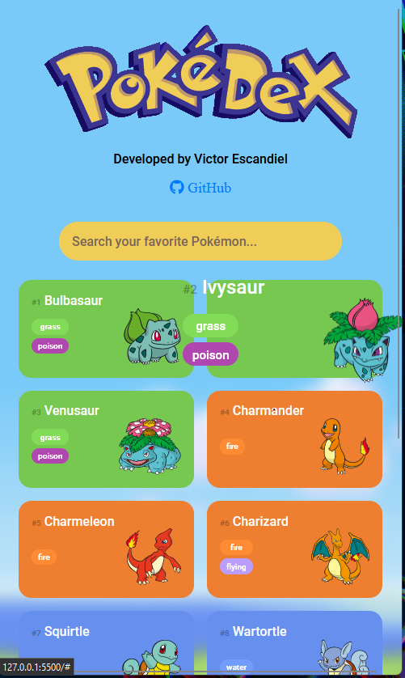

# Trilha JS Developer - Pokedex

Projeto desenvolvido a partir do Desafio do Bootcamp SantanderDIO, intuito de modificar e alterar a página e implementar novas funcionalidades com JavaScript a partir da PokeAPI

## Features Implementadas 💫

- Search Bar com filter dos Pokémons por nome;
- UI remodelada;
- Responsividade;

